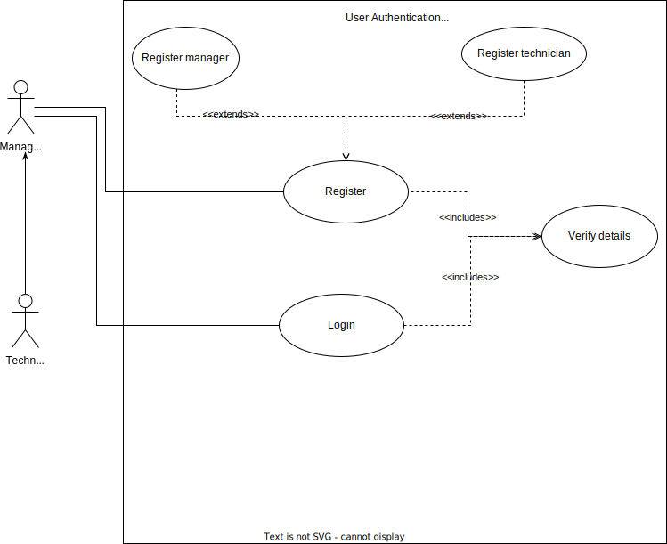
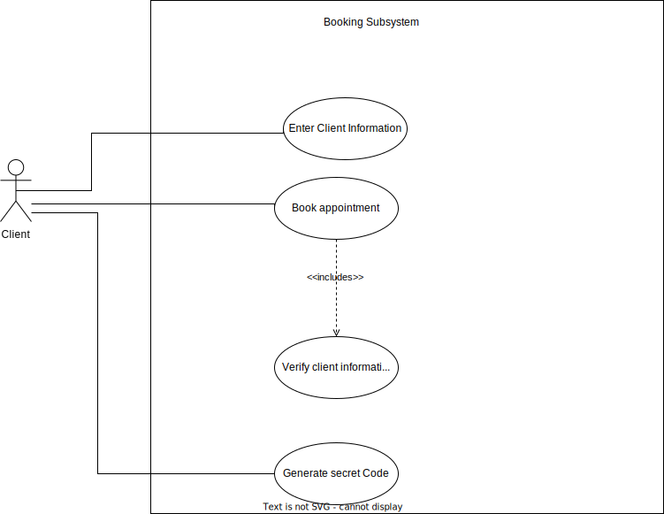
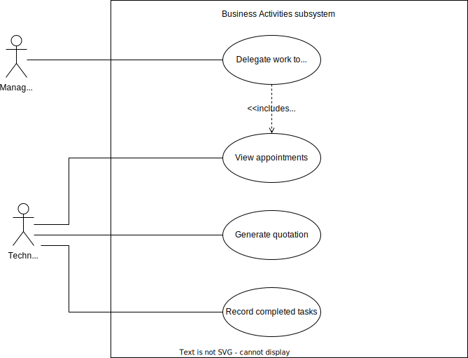

# TABLE CONTENTS
## 1. Background, Problem Statement & Proposed Solution
####   1.1 Introduction
####   1.2 Company/Industry background 
####   1.3 Current system(s) and/or procedures followed.
####   1.4 Problem Statement: Concise description of the issue to be addressed.
####   1.5 Proposed Solution: Should apply a desired result to the problem and describe the benefits

## 2. Requirements Extraction 
#### 2.1 Functional requirements
#### 2.2 Non-functional requirements
#### 2.2.1  Metrics for non-functional requirements

## 3. Identification and Prioritisation of Use Cases 

## 4. Feasibility and Risk Study 
#### 4.1 System feasibility
#### 4.1.1 Similarities with existing systems
#### 4.2 Technical feasibility
#### 4.2.1 Hardware and software requirements
#### 4.3 Economic feasibility
#### 4.3.1 Affordability of such a system
#### 4.4 Operational feasibility(Including the human factor)
## _________________________________________________________________________________________________________________________________________

## 1. Background, Problem Statement & Proposed Solution
####  1.1 Introduction
         The CM Electricals is an electrical company which was founded in 2008.
         The company's purpose is offer the world  with electrical services and make a difference. The services offered are:Connection of car   lifting, Connection of borehole motors, COC, Generator installation, Solar systems installation, House wiring,  Aircorn installation, Electric fence and Maintanance for the provided services.

####   1.2 Company/Industry background 
        This company was founded in 2008 by Mr Mashigo who was first a manager for a certain company that offered electrical services before realising that there was a demand for electricians who offered various services in his area. It was first offering a few services
        then few years later they started expanding the business and offering more services such as generator installation, solar systems installation and etc. Later on in 2021 the company was then handed to Mr Junior Mashigo after the passing of his father.
####   1.3 Current system(s) and/or procedures followed.

        Solar system installation
        Based on the services provided, if they were to Install a solar system, the first step is determining how much power the customers need, and planning their solar system accordingly. After that, the setup is fairly straightforward; 1.They Gather all the required components together; panels, inverter, batteries, cables, etc. 2. They ensure that they find a safe space in your home to house the inverter and batteries

        Air con Installation
        When they install an Air con, the positioning of an air conditioning system is very important for it to work efficiently. You should select a location in the interior wall that is not obstructed to mount the air conditioning unit. They then Fix the mounting plate on the interior wall
        to select the place where you want to install the unit and hold the mounting plate against it. Followed by Making a hole into the wall to fit the piping depending on the opening on the mounting bracket, look for the best place for the hole on the exterior. The company then check the electrical connections along with the connection of the pipes to ensure efficient connection.

        Electric Fence Installation
        When setting up an electric fence they start of by planning a lay out before they can actually decide on how many brace corners they will need
        of which each corner of the electrical fence will need to be braced with a corner piece. Due to the company always providing the best services they then ensure that they get enough fence posts and then select the charger that is more suitable and the wires.

        car lift connection
        To wire a car lift, start by running a length of wire from the power source to the lift. Next, connect the lift to the ground using a grounding rod. Finally, connect the positive and negative wires to the lift using a cable.

        House Wiring 
        Before the company begin to wire the houses, for them it’s essential that they first locate and mark the spots for any cable boxes or electrical outlets. They then place a frame where the box its going to be, either high or low. Next, they need to drill holes through the wall studs so they can run the electrical cables through them around the room. This ensures they don’t sit on the ground behind the wall and stay nice and organized. After, they thread the cable through the holes in each stud. This may take some time to do depending on how many cables the client have going through it. Lastly Once they reach the cable to the intended circuit or switch box, cut it to size, leaving at least 12 inches of extra at first and then run cables to the main circuit panel.

####   1.4 Problem Statement: Concise description of the issue to be addressed. 
        The executives of the company are realizing that the company is continuing to expand and with that they will need to have a more efficient way of reaching and interacting with their customers. Their day to day business processes are also starting to become harder to manage due to the workload.

####   1.5 Proposed Solution: Should apply a desired result to the problem and describe the benefits
        Create the system where client will be able to book an appointment for the service they need.
        When the clients book an appointment they should be able to specify an issue encountered that needs to be resolved by the 
        company and state whether is it for a Big company or just a house. Due to the increase in company's daily workload, the system will also allow the manager to delegate the work to employees (techniacians) based on the customer's demands, therefore, the employees will be able to monitor and manage their work schedule easier, as a result, they will be able to attend to customer's demand in no time. 
        Benefits: - The company will be easily accessed : The customers will be able to access the company easily rather than being 
                   reffered by someone who knows the company when they are in need of electrical services.
                  - The company will be able to track how they are doing : The company will be able to see how much profit they made based of the number of appointments they attend to. 
		          - Saving money and time (for client): The clients will be able to save their time and money, because they won't be a need to go to the company physically.
                  - The company will be able to ensure whether their technicians completed all aspects of each job or not : The company will track their technicians' on whether they went to the right place or not. The technicians will log each job they have completed.
                   

## 2. Requirements Extraction 
#### 2.1 Functional requirements
        - System must allow client to book an appointment
        - System must allow manager to track appointments
        - The system must allow the manager to delegate work to employees
        - The system must allow the technicians to keep track of activities to be completed and record them once completed.
        - System must generate quotation for the client
#### 2.2 Non-functional requirements
#### 2.2.1  Metrics for non-functional requirements
        Security: The system will allow the technician and the manager to login in order to access their customers appointments and other information. The technicians will have access to less personal details about the client. The client will receive a secret code upon booking an appointment that they will use to access their booking information.

        Usability: The system will be easy to use especially for the clients. The system will be less complicated, it will only expose the functionality the clients need to manage their appointments.

## 3. Identification and Prioritisation of Use Cases 
## User Authentification
  
 ###  Use case: User Authentification

 **Input**: The user logs in or registers as Manager or technician
 ####
 **Output**: User gets redirected to a home page
 ####

 1. The Manager or Technician enters his/her credentials to login or register.
 1. The System verifies the information.
 1. Then user then gets logged in or registered.

 **Extension**
 ####
 2a. The system rejects the credentials
1. The user will be prompted to re-enter their credentials.
## ______________________________________________________________________________________
## Booking

 ###  Use case: Booking

 **Input**: The client enters information required for booking
 ####
 **Output**: The client receives a secret code to track their booking
 ####

 1. The client enters booking information
 1. The System verifies the information.
 1. Upon the sytem finsihing the verification, the system then generates a unique secret code for the client to use for tracking their booking.

 **Extension**
 ####
 2a. The system rejects the invalid email 
1. The user will be prompted to re-enter their email.
#### 2b. The system rejects the invalid telephone number
1. The user will be prompted to re-enter their telephone number.

## ______________________________________________________________________________________
## Business Activities

 ###  Use case: Business Activities

 **Input**: Manager delegates tasks to technicians
 ####
 **Output**: The technician generates quotation for clients and records completed tasks to be tracked by manager.
 ####

 1. The manager will first view the appointments available then delegate tasks to technicians.
 1. The technicians will complete the tasks delegated to them, they will generate quotations for clients and also record the tasks completed.

## 4. Feasibility and Risk Study 
#### 4.1 System feasibility
#### 4.1.1 Similarities with existing systems
        The commonalities our system will have with the existing systems such as Mrvolt and Hjjelectrical are that , they will both generate a quotation for the client, even though our system will do it in a more effecient and fair manner which will be specific to the individual client.
        The difference with our system and most systems we have found is that our system allows the client to use a unique secret code to track and monitor the progress of the services being rendered for the specific client.
#### 4.2 Technical feasibility
        The system can be succesfully developed, implemented, and operated with the available technology, infrastructure and resources available at hand such as Data Storage, security measures, hardware and software tools.
#### 4.2.1 Hardware and software requirements
        Hardware requirements - Computer and a mobile phone.
                                Cloud Storage and Servers.
        Software requirements - Operating System to run our system on.
                                IDE to develop the software system on.
                                Version Control system such as git for tracking and managing changes to software code.
                                Database Management System such as MySQL or Mircrosoft SQL server.

#### 4.3 Economic feasibility
        Our project is viable from a financial perspective, It involves assessing the costs and benefits associated with a project, and we determine whether the expected financial returns justify the investment of resources.
#### 4.3.1 Affordability of such a system
        To determine the affordability of a system, one needs to consider both the initial costs of implementation as well as the ongoing operating costs.
        The initial costs may include expenses such as equipment, software, installation, and training. 
        The ongoing operating costs may include maintenance of the system, upgrades of the system we are building for the company, energy consumption, and staffing.
        In addition to these costs, we consider the potential benefits and savings that the system may provide.
        These may include increased efficiency of how the company is running, reduced labor costs,
        The system will also improve the productivity amongst the employees to do a better job, and better decision-making.
#### 4.4 Operational feasibility(Including the human factor)
        Our system will align with the organization's culture and values, making sure that it is well-received by all stakeholders, as a result, it will make the business operate more efficiently with better business outcomes and less physical human involvement in the process. 
        Our system will be user-friendly and help in automating some of the business operations that were usually done by employees and it will in return save time and effort that was normally put in completing those tasks.

