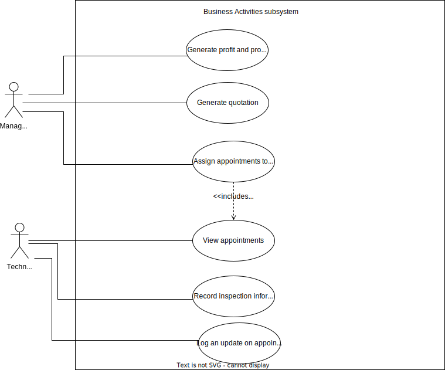
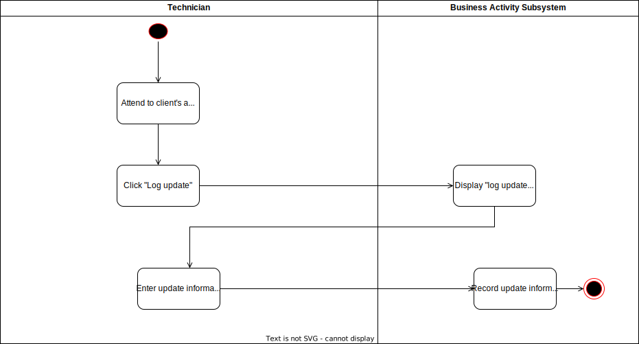

# TABLE CONTENTS
### 1. Problem Statement & Proposed Solution
####   1.1 Problem Statement
####   1.2 Proposed Solution

### 2. Use Cases & Use Case Descriptions

### 3. Activity Diagrams

### 4. Database Design
##
_________________________________________________________________________________________________________________________________________

## 1. Problem Statement & Proposed Solution
####   1.1 Problem Statement:
The executives of the company are realizing that the company is continuing to expand and with that they will need to have a more efficient way of reaching and interacting with their customers. Their day to day business processes are also starting to become harder to manage due to the workload.The company may also face challenges in collecting and analyzing customer feedback effectively, resulting in missed opportunities to understand customer needs, preferences, and pain points, leading to a disconnect between the company and its customers.

####   1.2 Proposed Solution:
Create the system where client will be able to book an appointment for the service they need.
When the clients book an appointment they should be able to specify an issue encountered that needs to be resolved by the 
company and state whether is it for a commercial or residential property. Due to the increase in company's daily workload, the system will also allow the manager to delegate the work to employees (techniacians) based on the customer's demands, therefore, the employees will be able to monitor and manage their work schedule easier, as a result, they will be able to attend to customer's demand in no time. 
        Benefits:
 - The company will be easily accessed : The customers will be able to access the company easily rather than 
              being referred by someone who knows the company when they are in need of electrical services.
 - The company will be able to track how they are doing : The company will be able to see how much profit   they made based of the number of appointments they attend to. 
- Saving money and time (for client): The clients will be able to save their time and money, because they       won't  be a need to go to the company physically.
 - The company will be able to ensure whether their technicians completed all aspects of each job or not : The   company will track their technicians' on whether they went to the right place or not. The technicians will log each job they have completed.

## 2. Use Cases & Use Case Descriptions
## User Authentification
  
 ###  Use case: User Authentification

 **Input**: 1.The user logs in as a manager or technician 
 
 ####
 **Output**: User gets redirected to a home page
 ####

 1. The Manager or Technician enters his/her credentials to login.
 1. The System verifies the information.
 1. Then user then gets logged in or registered.

 **Extension**
 ####
 2a. The system rejects the credentials
1. The user will be prompted to re-enter their credentials.
## _____________________________________________________________________
## Booking

 ###  Use case: Booking

 **Input**: The client enters information required for booking
 ####
 **Output**: The client receives a reference code to track their booking
 ####

 1. The client enters booking information
 1. The System verifies the information.
 1. Upon the sytem finishing the verification process, the system then generates a unique reference code for the client to use for tracking their booking.

 **Extension**
 ####
 2a. The system rejects the invalid email 
1. The user will be prompted to re-enter their email.
#### 2b. The system rejects the invalid telephone number
1. The user will be prompted to re-enter their telephone number.

## _____________________________________________________________________
## Business Activities

 ###  Use case: Business Activities

 **Input**: Manager delegates tasks to technicians
 ####
 **Output**: The manager generates quotation for clients and records completed tasks to be tracked by manager.
 ####

 1. The manager will first view the appointments available then delegate tasks to technicians.
 1. The technicians will complete the tasks delegated to them, they will generate quotations for clients and also record the tasks completed.

 ### 3. Activity Diagrams

  #### Log in 
  ##### Pre-Conditions 
 - The manager must have the manager credentials to be able to log in.
 - The technician must have technician credentials to be able to log in. 
 

 ## _______________________________________________________________________
  #### Book appointment
  ##### Pre-Conditions 
 - The client must have a valid email address.
 

  ## _______________________________________________________________________
  #### Assign Appointment
  ##### Pre-Conditions 
 -  Manager must be logged 

  ## ________________________________________________________________________
  #### Generate Quoation
  ##### Pre-Conditions 
  - Technician must have went for inspection
  

   ## _______________________________________________________________________
  #### Record Inspection Information
  ##### Pre-Conditions 
  - Technician must receive a booking
  - Technician must go and inspect
  - Technician must record inspected information
  - Technician must have went for inspection
  

    ## _______________________________________________________________________
  #### Generate profit and Productivity Data
  ##### Pre-Conditions
  - Manager must be logged in
  

   ## _________________________________________________________________________
   #### Log an update on appointment progress
   ##### Pre-Conditions
  - Technician must be logged in
  

### 4. Database Design

 
